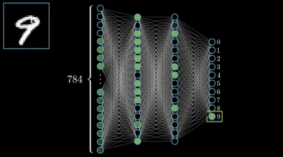

# Deep Neural Network for MNIST Classification

This repository implements a fully functional Deep Neural Network (DNN) built from scratch using PyTorch. The module supports advanced training features like **batch normalization**, **early stopping**, and **L2 regularization**. It is designed for experimentation and provides an easy-to-use interface for defining, training, and evaluating deep learning models.

The module is used in the `main.ipynb` to run several experiments on the MNIST dataset.



---

## Features
- **Customizable Network Architecture**: Easily define the number of layers and neurons.
- **Training Optimizations**:
  - **Batch Normalization**: Normalize activations for faster convergence.
  - **L2 Regularization**: Prevent overfitting by penalizing large weights.
  - **Early Stopping**: Automatically stop training if validation performance stagnates.
- **MNIST Classification**: Built-in functionality for loading and preprocessing the MNIST dataset.
- **Logging**: Verbose and non-verbose options for tracking training progress.
- **Experimentation**: Modular codebase with configurable parameters for running multiple experiments efficiently.

---

## Repository Contents

### `deep_nn.py`
The core module implementing the Deep Neural Network. Below are the key public methods:

#### `DeepNeuralNetwork`
The main class for building and training the DNN.

**Constructor Parameters**:
- `layers_dims` (list): List of integers defining the network architecture (input to output layers) You must ensure that `layers_dims[0]` is equal to your training input, which in this case is a 28 X 28 picture (= 784).
- `num_iterations` (int): Maximum number of training iterations (default: `100000`, expecting for an early stop to occur).
- `learning_rate` (float): Learning rate for gradient descent (default: `0.009`).
- `batch_size` (int): Size of each mini-batch for training (default: `64`).
- `use_batchnorm` (bool): Whether to apply batch normalization (default: `False`).
- `lambd` (float): L2 regularization strength (default: `0.0` -> no regularization).
- `validation_split` (float): Fraction of training data used for validation (default: `0.2`).
- `early_stopping` (bool): Whether to use early stopping (default: `True`).
- `stopping_steps` (int): Patience for early stopping (default: `100`).
- `verbose` (bool): Whether to log training progress (default: `True`).

**Public Methods**:
1. `train(X, Y)`: Trains the neural network using minibatch stochastic gradient descent. 
   - **Inputs**: 
     - `X` (torch.Tensor): Training data of shape `(input_size, num_examples)`.
     - `Y` (torch.Tensor): One-hot encoded training labels of shape `(num_classes, num_examples)`.
   - **Outputs**:
     - `costs` (list): A list of tuples `(train_cost, val_cost)` logged during training.
     - `best_parameters` (dict): Model parameters with the best validation cost. You can use to inspect the effect of different configurations on the final weights.
     - `train_accuracy` (float): Accuracy on the training data.
     - `val_accuracy` (float): Accuracy on the validation data.

2. `predict(X, Y)`: Computes the accuracy of the model on a given dataset.
   - **Inputs**:
     - `X` (torch.Tensor): Data features of shape `(input_size, num_examples)`.
     - `Y` (torch.Tensor): One-hot encoded labels of shape `(num_classes, num_examples)`.
   - **Outputs**:
     - `accuracy` (float): Accuracy of the model as a percentage.

---

### `load_mnist`
A utility function for loading and preprocessing the MNIST dataset.

#### `load_mnist()`
Loads the MNIST dataset, normalizes pixel values, and one-hot encodes the labels.

**Returns**:
- `X_train` (torch.Tensor): Training features of shape `(784, m_train)`.
- `Y_train` (torch.Tensor): One-hot encoded training labels of shape `(10, m_train)`.
- `X_test` (torch.Tensor): Test features of shape `(784, m_test)`.
- `Y_test` (torch.Tensor): One-hot encoded test labels of shape `(10, m_test)`.

---

### `main.ipynb`
A Jupyter Notebook designed for running experiments and showcasing the module's functionality.

#### Notebook Highlights:
1. **Experiment Setup**:
   - Configurable parameters like stopping steps, batch normalization, and L2 regularization.
2. **Multiple Experimentation**:
   - Automates a series of experiments (e.g., regular vs batch normalization, with and without L2 regularization).
   - Outputs results in a summarized DataFrame for comparison.
3. **Performance Visualization**:
   - Plots training and validation costs over iterations to analyze convergence.
4. **Model Evaluation**:
   - Evaluates the best model from each experiment on the test set.
   - Compares accuracies for different configurations.

---

## Running the Project

1. Clone the repository:
   ```bash
   git clone https://github.com/shaharoded/DeepNN_for_MNIST_Classification.git
   ```
2. Locate the files in your local environment.
2. Open `main.ipynb` in Google Colab and set the runtime to GPU for faster training.
3. Upload the `deep_nn.py` module to the `content\` directory in Colab and execute the notebook.

Why Google Colab? Google Colab is chosen for its pre-built compatibility with required libraries and access to a free GPU (subject to quota limits), enabling efficient model training.
